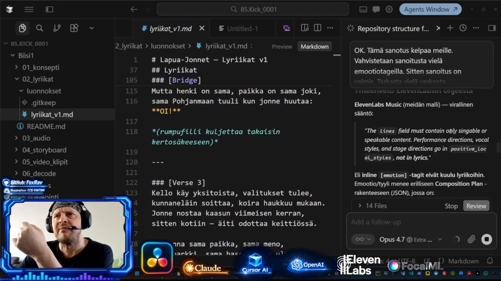
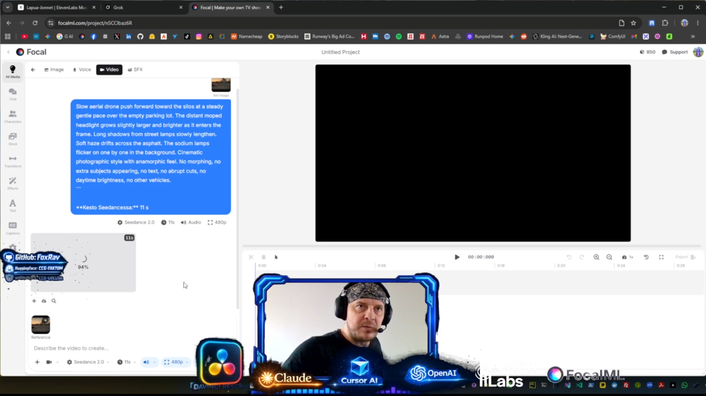

<div align="center">

**English · [Suomeksi](README.fi.md)**

# Politrukki — Lapua Jonne!

### AI-native music video production workflow · orchestrated end-to-end in Cursor · from idea to YouTube release

[]()
[](https://cursor.com)
[]()
[]()
[]()
[](LICENSE)
[](https://kick.com/politrukki)


</div>

---

## About

**Lapua Jonne!** is the first music video shipped on the Politrukki Live production pipeline — a **working AI-native production system** that takes a single creator from song idea to a published, multi-platform release without a studio, without a band, and without a video crew.

**Cursor is the orchestration layer.** Claude, ChatGPT, ElevenLabs, FocalML Seedance, and DaVinci Resolve are the execution engines plugged into it. The combination is what makes a one-person operation ship at full production quality across audio, video, stems, master, and platform-specific deliverables.

This repository is the **actual pipeline that shipped the song** — every prompt, every config, every script, every README, every render setting that was used to make the released video. Fork it, plug your own song idea into the same workflow, and ship a finished music video on the same path.

About the song: **Lapua Jonne!** is a roots reggae track about a 17-year-old Finnish *jonne* (slang for a small-town teenage moped kid) revving his tuned 80cc PV-Suzuki on the old VR railyard in Lapua, next to a derelict cartridge factory. Same restless Ostrobothnian spirit as the 1800s *puukkojunkkarit* knife-fighters — only the throttle has replaced the blade.

> A real release. A real pipeline. Both shipped publicly.

---

## Watch & listen

<div align="center">

[](https://www.youtube.com/watch?v=dnFbXpW00kM)

**▶ [Watch on YouTube](https://www.youtube.com/watch?v=dnFbXpW00kM)**

</div>

| | |
| --- | --- |
| YouTube | [youtube.com/watch?v=dnFbXpW00kM](https://www.youtube.com/watch?v=dnFbXpW00kM) |
| Live build *(see how this was made)* | [kick.com/politrukki](https://kick.com/politrukki) |
| Lyrics | [`02_lyriikat/lyriikat_final.md`](02_lyriikat/lyriikat_final.md) |
| YouTube metadata (title / description / tags) | [`09_julkaisu/metadata.md`](09_julkaisu/metadata.md) |
| Live progress dashboard (open in browser) | [`html/checklist.html`](html/checklist.html) |

> **About the live build:** Stages 01–07 and 09 of the pipeline are built openly and live on [kick.com/politrukki](https://kick.com/politrukki). **Exception:** stage **08 (DaVinci Resolve)** is produced offline — running a Resolve 4K timeline together with an OBS broadcast exceeds the current workstation's performance budget. The editing stage is visible in the final output, not as a process.

---

## Architecture overview

<div align="center">


</div>

Linear flow, top to bottom: AI tools (blue) produce content (outlined outputs), which lands in **DaVinci Resolve** (green) — the assembler that combines every asset — and is finally rendered out to every distribution platform (yellow). One song, one master project, every aspect ratio and loudness target hit on the way out.

---

## Pipeline — 9 stages

| # | Stage | Tool | Folder |
| --- | --- | --- | --- |
| 01 | Ideation & concept | Claude / Brainstorm | [`01_konsepti/`](01_konsepti/) |
| 02 | Lyrics & structure | Claude | [`02_lyriikat/`](02_lyriikat/) |
| 03 | Audio & vocals | ElevenLabs Music | [`03_audio/`](03_audio/) |
| 04 | Visual storyboard | Claude / Storyboard | [`04_storyboard/`](04_storyboard/) |
| 05 | Video clip generation | FocalML Seedance 2.0 | [`05_video_klipit/`](05_video_klipit/) |
| 06 | Decode & conversion | FFmpeg (DNxHR / ProRes) | [`06_decode/`](06_decode/) |
| 07 | Stem separation | Audacity · OpenVINO (Demucs v4) | [`07_stems/`](07_stems/) |
| 08 | **Editing, mixing, color, mastering & deliverables** — *everything gets dialed in here* | **DaVinci Resolve** (Edit · Fairlight · Color · Fusion · Deliver) | [`08_editointi/`](08_editointi/) |
| 09 | Release | YouTube · *Politrukki Live* | [`09_julkaisu/`](09_julkaisu/) |

Each stage folder has its own `README.md` with a checklist and a guide for executing that specific stage.

---

## Tech stack

| Role | Tool |
| --- | --- |
| **Workflow orchestration · the layer the whole project runs on** | **`Cursor` — AI-native production workspace** |
| Scriptwriting & prompts | `Claude` (Anthropic · used inside Cursor) |
| Reference imagery | `ChatGPT` (OpenAI · image generation) |
| Music generation | `ElevenLabs Music` |
| Video (image-to-video) | `FocalML Seedance 2.0` |
| Stem separation | `Audacity` + `OpenVINO` (Demucs v4) |
| Codec conversion for Resolve | `FFmpeg` (DNxHR / ProRes) |
| **Editing · audio mix · color · master · deliverables** | **`DaVinci Resolve` (Blackmagic Design) — the assembler of the whole package** |
| Publishing | `YouTube Studio` · `TikTok` · `Instagram Reels` |
| Live broadcasting | `OBS Studio` · `Kick` |

---

## Tools in action

Real screenshots from the build. The pipeline isn't theoretical — every tool listed above is driving the work hands-on.

<table>
  <tr>
    <td width="50%" align="center">
      <a href="html/screenshots/cursor-claude-opus.png"></a>
      <br/>
      <strong>Cursor IDE  ·  Claude Opus 4.7</strong>
      <br/>
      <sub>Lyrics, prompts, READMEs, repo structure, and Resolve guidance all written together with Claude.</sub>
    </td>
    <td width="50%" align="center">
      <a href="html/screenshots/focalml-seedance.png"></a>
      <br/>
      <strong>FocalML  ·  Seedance 2.0</strong>
      <br/>
      <sub>Image-to-video generation for all 24 clips, with native audio and lip-sync.</sub>
    </td>
  </tr>
</table>

---

## Workflow orchestration

This entire end-to-end production runs through **Cursor** as its single orchestration layer. Every stage of the pipeline — from the first idea to the rendered deliverables — touches Cursor, and the live build streams on Kick are literally a screencast of Cursor doing the work.

Cursor functions in this project as:

- **Workflow orchestration layer** — all 9 phase folders, every prompt, every script, every README, and every config sit in a single workspace, and Claude inside Cursor sees them all at once
- **AI-assisted writing environment** — lyrics, READMEs, prompts, ElevenLabs composition plans (JSON), YouTube metadata, TikTok copy, screenplay, license texts
- **Repository-wide context engine** — Claude reasons across all 9 phases simultaneously, not just one open file at a time; this is what makes the "system" coherent
- **Production scripting environment** — FFmpeg conversion batches, Whisper transcription glue, Demucs stem runs, file renames, prompt-to-prompt consistency checks
- **Architecture & documentation tool** — this README, the bilingual fork of it, the architecture diagram, the per-phase READMEs, the JSON configs, the `.gitignore`, the license — all authored inside Cursor
- **Multimodal coordination hub** — image prompts → reference images → Seedance video prompts → Resolve cut decisions, all chained through one workspace with no manual round-trips
- **Public, livestreamed production workspace** — broadcast openly on [kick.com/politrukki](https://kick.com/politrukki) so the workflow can be observed end-to-end, in real time, by anyone

> The song ships. The pipeline ships with it. The next release uses the same machinery.

---

## Why Cursor

Modern AI-native production is **not** about prompting one model and hitting render. It is about **coordinating many models, many file formats, many code paths, and many human decisions** across hours of work — and keeping it all consistent, reproducible, and visible.

That coordination problem is what Cursor solves for this project. In concrete terms:

- **Rapid iteration on prompts and assets** — Claude Opus 4.7 inside the editor, with the entire repo as context, instead of round-tripping between a chat UI and the filesystem
- **Multimodal workflow coordination** — text, JSON, scripts, audio metadata, and video render configs all live in the same workspace, edited with the same shortcuts
- **Repository-wide context understanding** — Claude reasons across all 9 phase folders simultaneously; this is what allows a *system* to emerge rather than a pile of disconnected prompts
- **Production scripting on demand** — small but production-critical tools (renaming, JSON validation, transcription glue, FFmpeg batches) are generated in seconds, not days
- **Architecture planning that survives the project** — instead of "vibes engineering", the pipeline ships as documented, repeatable, fork-able infrastructure
- **Public, AI-assisted production workflows** — the live builds on Kick demonstrate exactly *how* a real Cursor-driven production looks, in real time, in front of an audience

Cursor is what turns a single creator into a full production house. The song ships, the pipeline that shipped it ships with it, and the next track uses the same machinery — at the same quality, in roughly the same time. **This is a working production system, not an experiment.**

---

## DaVinci Resolve — where it all comes together

Resolve isn't just an editor — it's the **finisher** for the entire package. Every AI-generated asset (24 video clips, 1 master audio, 4 stems, Whisper transcriptions) lands on a single timeline and is dialed in to the second.

### What gets done in Resolve

| Page | What is dialed in |
| --- | --- |
| **Media / Cut** | Import of all AI assets: 24 × Seedance clips, ElevenLabs master audio, 4 stem tracks (vocals / drums / bass / other), reference imagery when needed |
| **Edit** | Cuts on the beat (markers at 85 BPM), section structure (intro → 3 verses → 3 choruses → bridge → outro), transitions, b-roll placement |
| **Fairlight** | Multi-stem audio mix: vocals isolated, drum bus, bass bus, FX layer; volume automation per verse vs. chorus; sidechain ducking for voiceovers; EQ + compression; LUFS master normalization (-14 LUFS for YouTube, -16 LUFS for TikTok) |
| **Color** | Per-clip color grading: consistent teal/orange look, sepia exception for the *puukkojunkkari* flashbacks, vignette, film grain |
| **Fusion** | Subtitles (lyrics), end credits, logo bumper at start/end, motion graphics |
| **Deliver** | Render to multiple formats |

### Deliverables — one project, many exports

The `Deliver` page is used to render multiple versions out of the same master project:

| Platform | Resolution | Aspect | FPS | Codec | LUFS | Duration |
| --- | --- | --- | --- | --- | --- | --- |
| **YouTube** (master) | 3840 × 2160 / 1920 × 1080 | 16:9 | 25 | H.264 / H.265 | -14 | 3:55 |
| **TikTok / Reels / Shorts** | 1080 × 1920 | 9:16 | 30 | H.264 | -16 | 0:30 – 0:60 cutdown |
| **Instagram Feed** | 1080 × 1080 / 1080 × 1350 | 1:1 / 4:5 | 30 | H.264 | -14 | 0:60 |
| **Subtitles** | SRT / TTML | — | — | — | — | from Whisper transcription |

### What this means in practice

> AI generates the raw material — Resolve turns it into a **finished product**. The same master project feeds every platform, and each export hits exactly the spec that platform's algorithm prefers (aspect ratio, duration, audio loudness).

More detail: [`08_editointi/README.md`](08_editointi/README.md)

---

## What's in this repo

| What | Where |
| --- | --- |
| Song brief and reference imagery | [`01_konsepti/referenssit/`](01_konsepti/referenssit/) |
| Final lyrics | [`02_lyriikat/lyriikat_final.md`](02_lyriikat/lyriikat_final.md) |
| ElevenLabs Music composition plan (JSON) | [`02_lyriikat/composition_plan.json`](02_lyriikat/composition_plan.json) |
| ElevenLabs ready-to-paste text prompt | [`02_lyriikat/elevenlabs_prompt.txt`](02_lyriikat/elevenlabs_prompt.txt) |
| Storyboard (shot list, 24 clips) | [`04_storyboard/shot_list.md`](04_storyboard/shot_list.md) |
| Visual style guide (character / location / camera) | [`04_storyboard/style_guide.md`](04_storyboard/style_guide.md) |
| GPT + Seedance prompts (12 files, ordered) | [`04_storyboard/promptit/`](04_storyboard/promptit/) |
| YouTube title + description + tags + chapters | [`09_julkaisu/metadata.md`](09_julkaisu/metadata.md) |
| Live progress dashboard (offline HTML, localStorage) | [`html/checklist.html`](html/checklist.html) |

---

## Repository structure

```
Biisi1/
├── 01_konsepti/        Brief, mood board, reference imagery
├── 02_lyriikat/        Lyrics + ElevenLabs Music config
├── 03_audio/           Audio master (binaries kept locally)
├── 04_storyboard/      Shot list + 24-clip GPT/Seedance prompts
├── 05_video_klipit/    Video raw + approved (binaries kept locally)
├── 06_decode/          FFmpeg scripts for DaVinci
├── 07_stems/           Demucs-separated stems (kept locally)
├── 08_editointi/       DaVinci Resolve project — THE ASSEMBLER OF EVERYTHING (kept locally)
├── 09_julkaisu/        YouTube + TikTok publishing copy
└── html/               Live progress dashboard + checklist screenshot
```

> Folder names are intentionally kept in Finnish to match the live build streams and the original source-of-truth filesystem on the workstation.

The repo contains the **text-based core** of the production (lyrics, prompts, screenplay, publishing copy). Heavy media files (audio masters, video clips, the DaVinci project) are kept locally and are only referenced in the documentation.

---

## Usage

1. **Open [`html/checklist.html`](html/checklist.html)** in your browser — you can see live which stage the production is in.
2. **Go through the folders in order** from `01_konsepti/` to `09_julkaisu/`.
3. **Read the stage's `README.md`** before starting — it contains the checklist and the tool guide for that specific stage.
4. **Copy the prompts as-is** into ChatGPT, ElevenLabs, or FocalML Seedance — each file contains `copy-paste`-ready blocks.

---

## By the numbers

| | |
| --- | --- |
| Song length | 3 min 55 s |
| Genre | Roots reggae · 85 BPM · D minor |
| Lyrics | Finnish, with South Ostrobothnia dialect references |
| Video clips | 24 pcs, 7–11 s per clip |
| GPT reference images | 24 pcs |
| Seedance renders | 24 pcs |
| Production time, idea to release | ~5 days |

---

## AI Disclosure

Music produced with **ElevenLabs Music**. Video generated with **FocalML Seedance 2.0** (image-to-video). Reference imagery produced with **ChatGPT** image generation. Lyrics and screenplay co-written with **Claude**. Stems separated locally with **OpenVINO + Demucs v4**.

The YouTube release is flagged *Altered content* per YouTube's AI-content disclosure policy.

---

## Partnerships & sponsorship

This pipeline is built on commercial AI tools. Production is documented **openly and publicly** — every prompt, config, README, screenplay, helper script, and publishing text that built the video lives on GitHub under CC BY-NC 4.0. The process itself is streamed live on Kick, and every tool that touches the work is named in this README and in the YouTube description of the released video.

### Where we are today, and where API access would take us

Right now, Cursor is the orchestration **workspace**: every prompt, config, README, schedule, and decision lives there, and Claude reasons across the whole repo. Some stages still require hopping out to a web UI (ElevenLabs Music, FocalML Seedance, YouTube Studio), and the coordination between them is human-driven through Cursor.

The natural next step — given API access to the right tools — is to drive **every stage from inside Cursor directly via API calls**, turning the manual coordination layer into automated orchestration. This is a concrete, immediate area where a credit sponsorship or API partnership would have visible impact: on the public Kick streams, in this repository's helper scripts, and in the speed and consistency of every future release shipped on this pipeline.

### What I'm open to

If you represent one of the tools used here, you are welcome to reach out. I am open to:

- **Credit sponsorships** (free or discounted credits in exchange for visible attribution)
- **Grant / partnership programs** (creator, founders, research, education tracks)
- **Beta access** to upcoming models or features that fit this kind of work
- **Case-study collaboration** (long-form write-ups, video coverage, conference material)
- **Streaming integrations** (overlays, panel appearances, joint live builds on Kick)

In exchange I can offer:

- **Public, named attribution** on every public deliverable (YouTube descriptions, video credits, on-stream overlays, this README)
- **Open, reproducible documentation** of how the tool was actually used — promptable, copy-pasteable, with the trade-offs and gotchas honestly described
- **Live build coverage** on [kick.com/politrukki](https://kick.com/politrukki) where the tool can be shown in real production use
- **A clean, real-world reference project** — not a demo — that the tool's team can link to

### Tools currently used in this pipeline

**`Cursor`** *(workflow orchestration · the layer the whole project runs on)* · `Anthropic Claude` · `OpenAI ChatGPT` · `ElevenLabs Music` · `FocalML Seedance 2.0` · `Blackmagic Design DaVinci Resolve` · `Audacity` · `OpenVINO` (Demucs v4) · `FFmpeg` · `OBS Studio` · `Kick` · `YouTube`

### Get in touch

- Open an issue or discussion in this repository
- Reach out on the live build chat at [kick.com/politrukki](https://kick.com/politrukki)
- Email: *available on request via GitHub*

---

## License

This **system** (the repository structure, documentation, lyrics templates, prompts, screenplays, scripts, and pipeline) is licensed under **[Creative Commons Attribution-NonCommercial 4.0 International (CC BY-NC 4.0)](LICENSE)**.

### You may ✅

- **Use** the system yourself — for learning, hobby projects, your own songs
- **Modify** it and build your own versions
- **Share** modified or unmodified copies
- **Fork** it on GitHub and publish your own variant

### You may not ❌

- **Sell** the system or any part of it (as-is, repackaged, as an "AI course", as client deliverables, etc.)
- **Use the system commercially** without separate written permission from the author

### Required 📌

When you share or publish anything built on this system, **credit it in your credits section**:

```
Built with the "Politrukki — Lapua Jonne!" AI Music Video Pipeline
by Politrukki Live · https://github.com/FoxRav/politrukki-ai-music-video-pipeline
Licensed under CC BY-NC 4.0
```

> **In plain language:** Fork it, learn from it, build your own song with this pipeline, name the source — all good. Ask first if you want to use it commercially.

**Note.** The license covers the **system** (structure, tools, documentation). The released **song, video, and imagery** (`Lapua Jonne!` as an artistic work) is a separate copyrighted work, all rights reserved. The pipeline is shared; the work is not.

For commercial licensing, please contact the author.

© 2026 **Politrukki Live** · Lapua, Finland
