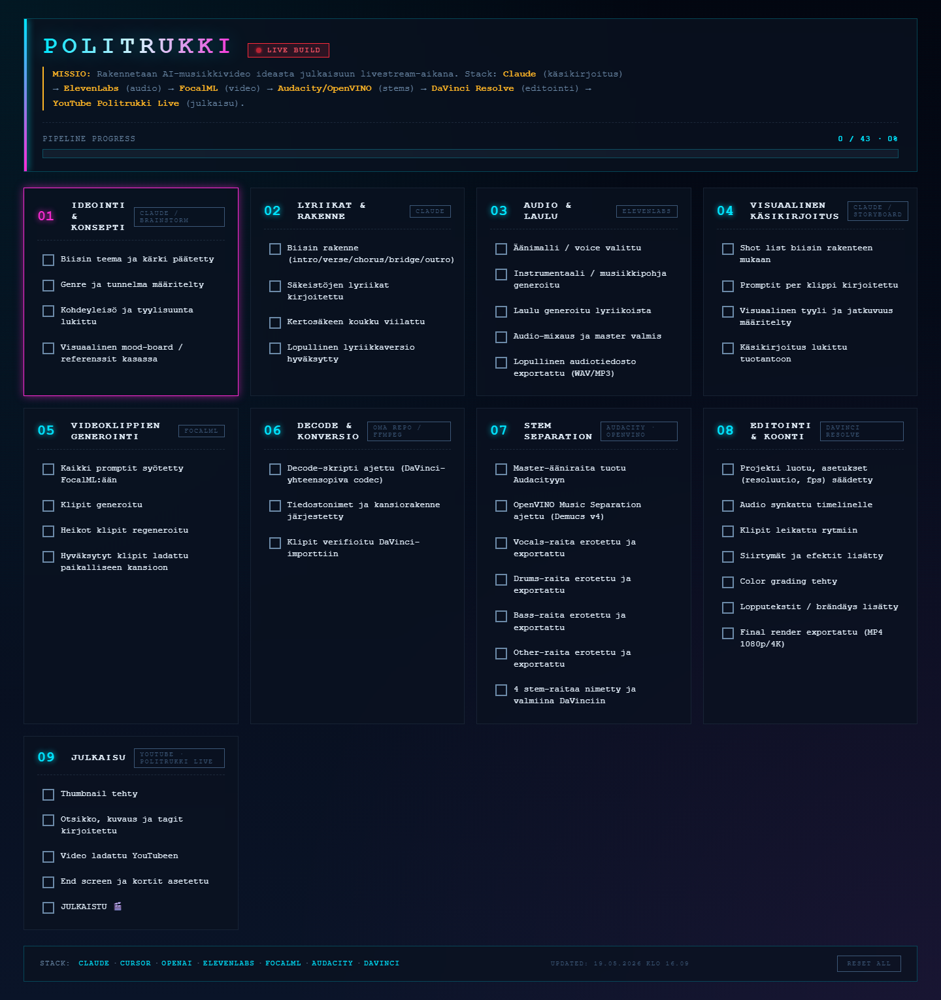

<div align="center">

# Politrukki — Lapua Jonne!

### AI-musiikkivideoputki ideasta YouTube-julkaisuun · 9 vaihetta · 1 biisi · 24 klippiä

[]()
[]()
[]()
[]()



</div>

---

## Mistä on kyse

**Lapua Jonne!** on roots reggae -biisi 17-vuotiaasta jonnesta, joka huudattaa viritettyä 80cc PV-Suzukiaan Lapuan VR-parkilla vanhan patruunatehtaan kupeessa. Sama Etelä-Pohjanmaan henki kuin 1800-luvun puukkojunkkareilla — vain kaasukahva on vaihtanut puukon paikan.

Tämä repo dokumentoi koko tuotannon: **ideasta → lyriikoista → audiosta → storyboardista → videoklipistä → editoinnista → julkaisuun**. Tavoitteena näyttää konkreettisesti miten yksi nykyaikainen AI-musiikkivideo rakennetaan alusta loppuun, mitkä työkalut toimivat mihinkin, ja mitä promptit oikeasti sisältävät.

> Yksittäinen tarina, avoin tuotantokansio.

---

## Kuuntele & katso

<div align="center">

[](https://www.youtube.com/watch?v=dnFbXpW00kM)

**▶ [Katso YouTubessa](https://www.youtube.com/watch?v=dnFbXpW00kM)**

</div>

| | |
| --- | --- |
| YouTube | [youtube.com/watch?v=dnFbXpW00kM](https://www.youtube.com/watch?v=dnFbXpW00kM) |
| Lyriikat | [`02_lyriikat/lyriikat_final.md`](02_lyriikat/lyriikat_final.md) |
| YouTube-metadata (otsikko/kuvaus/tagit) | [`09_julkaisu/metadata.md`](09_julkaisu/metadata.md) |
| Live-progress-dashboard (avaa selaimessa) | [`html/checklist.html`](html/checklist.html) |

---

## Pipeline — 9 vaihetta

| # | Vaihe | Työkalu | Kansio |
| --- | --- | --- | --- |
| 01 | Ideointi & konsepti | Claude / Brainstorm | [`01_konsepti/`](01_konsepti/) |
| 02 | Lyriikat & rakenne | Claude | [`02_lyriikat/`](02_lyriikat/) |
| 03 | Audio & laulu | ElevenLabs Music | [`03_audio/`](03_audio/) |
| 04 | Visuaalinen käsikirjoitus | Claude / Storyboard | [`04_storyboard/`](04_storyboard/) |
| 05 | Videoklippien generointi | FocalML Seedance 2.0 | [`05_video_klipit/`](05_video_klipit/) |
| 06 | Decode & konversio | FFmpeg (DNxHR / ProRes) | [`06_decode/`](06_decode/) |
| 07 | Stem separation | Audacity · OpenVINO (Demucs v4) | [`07_stems/`](07_stems/) |
| 08 | Editointi & koonti | DaVinci Resolve | [`08_editointi/`](08_editointi/) |
| 09 | Julkaisu | YouTube · *Politrukki Live* | [`09_julkaisu/`](09_julkaisu/) |

Jokaisessa vaihekansiossa on oma `README.md`, jossa on tehtävälista ja ohje juuri sen vaiheen suoritukseen.

---

## Tech stack

`Claude` · `ChatGPT` · `ElevenLabs Music` · `FocalML Seedance 2.0` · `Audacity + OpenVINO` · `DaVinci Resolve` · `FFmpeg` · `YouTube Studio`

---

## Mitä reposta löytyy

| Mitä | Missä |
| --- | --- |
| Biisin briefi ja referenssikuva | [`01_konsepti/referenssit/`](01_konsepti/referenssit/) |
| Lyriikat (final) | [`02_lyriikat/lyriikat_final.md`](02_lyriikat/lyriikat_final.md) |
| ElevenLabs Music composition plan (JSON) | [`02_lyriikat/composition_plan.json`](02_lyriikat/composition_plan.json) |
| ElevenLabs valmis tekstiprompti | [`02_lyriikat/elevenlabs_prompt.txt`](02_lyriikat/elevenlabs_prompt.txt) |
| Storyboard (shot list 24 klippiä) | [`04_storyboard/shot_list.md`](04_storyboard/shot_list.md) |
| Visuaalinen tyyliopas (character / location / camera) | [`04_storyboard/style_guide.md`](04_storyboard/style_guide.md) |
| GPT + Seedance promptit (12 tiedostoa, numerojärjestyksessä) | [`04_storyboard/promptit/`](04_storyboard/promptit/) |
| YouTube otsikko + kuvaus + tagit + chapters | [`09_julkaisu/metadata.md`](09_julkaisu/metadata.md) |
| Live progress-dashboard (offline HTML, localStorage) | [`html/checklist.html`](html/checklist.html) |

---

## Repo-rakenne

```
Biisi1/
├── 01_konsepti/        Brief, mood-board, referenssikuvat
├── 02_lyriikat/        Sanoitukset + ElevenLabs Music config
├── 03_audio/           Audio-master (binäärit lokaalisti)
├── 04_storyboard/      Shot list + 24 klipin GPT/Seedance promptit
├── 05_video_klipit/    Video raw + approved (binäärit lokaalisti)
├── 06_decode/          FFmpeg-skriptit DaVinciin
├── 07_stems/           Demucs-erotellut raidat (lokaalisti)
├── 08_editointi/       DaVinci-projekti (lokaalisti)
├── 09_julkaisu/        YouTube + TikTok julkaisutekstit
└── html/               Live progress dashboard + checklist-kuva
```

Repo sisältää koko tuotantoprosessin **tekstipohjaisen ytimen** (lyriikat, promptit, käsikirjoitus, julkaisutekstit). Raskaat mediatiedostot (audio-mastersit, video-klipit, DaVinci-projekti) säilytetään paikallisesti ja niihin viitataan vain dokumentaatiossa.

---

## Käyttö

1. **Avaa [`html/checklist.html`](html/checklist.html)** selaimessa — näet livenä missä vaiheessa tuotanto on.
2. **Etene numerojärjestyksessä** vaiheesta `01_konsepti/` vaiheeseen `09_julkaisu/`.
3. **Lue vaihekansion `README.md`** ennen aloitusta — siellä on kyseisen vaiheen tehtävälista ja työkaluohje.
4. **Kopioi promptit suoraan** valmiina ChatGPT:hen, ElevenLabsiin tai FocalML Seedanceen — tiedostoissa on `copy-paste`-blokit.

---

## Lopputulos lukuina

| | |
| --- | --- |
| Biisin pituus | 3 min 55 s |
| Genre | Roots reggae · 85 BPM · D-mol |
| Lyriikat | Suomeksi, Etelä-Pohjanmaan murreviittauksin |
| Videoklippejä | 24 kpl, 7–11 s / klippi |
| GPT-referenssikuvia | 24 kpl |
| Seedance-renderöintejä | 24 kpl |
| Tuotantoaika ideasta julkaisuun | ~5 päivää |

---

## AI Disclosure

Musiikki tuotettu **ElevenLabs Music** -mallilla. Video **FocalML Seedance 2.0** -mallilla (image-to-video). Referenssikuvat **ChatGPT** -kuvageneroinnilla. Lyriikat ja käsikirjoitus käsikirjoitettu yhteistyössä **Claude**-mallin kanssa. Stems erotettu paikallisesti **OpenVINO + Demucs v4** -mallilla.

YouTube-julkaisussa video on merkitty *Altered content* -lipulla YouTuben käytäntöjen mukaisesti.

---

## Lisenssi

All rights reserved · **Politrukki Live** · Lapua, Finland · 2026
